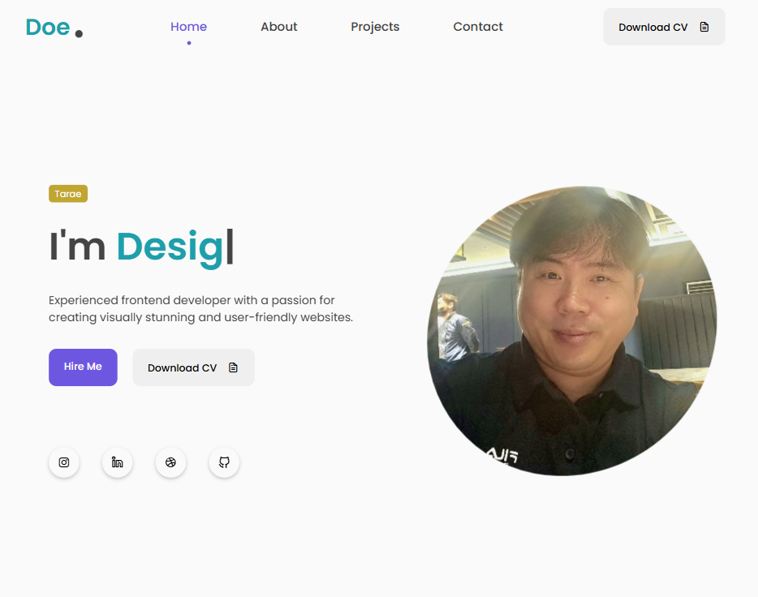

HTML, CSS, JavaScript를 사용한 반응형 포트폴리오 웹사이트

    
  ## ⚡ Technologies

  

Other features:
scrollreveal 애니메이션을 사용했습니다.  
typed.js로 타이핑 효과를 주었습니다.

## 이 포트폴리오 웹사이트의 주요 특징:

Hero Section:
간략하게 자기소개서를 하는 페이지 입니다.

About Section:
좀더 자세하게 자기소개를 합니다.

Projects Section:
완료된 프로젝트나 고객들의 만족스러웠던 부분등 해당 분야에서의 경험을 기재합니다..

Contact Section:
방문자가 연락할 수 있는 연락처
